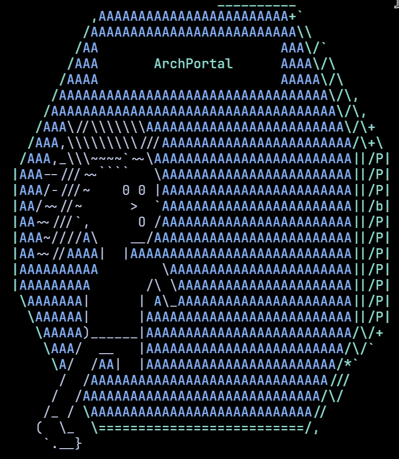

# Archlândia

## An opinionated set of tools to set up Arch Linux environments

This project started as a script to record functional notes about how to
set up and use an Arch Linux user space on the NVIDIA Jetson Orin Nano from the
default OS, an NVIDIA-customized Ubuntu kernel with drivers and other
customizations for their system-on-a-chip (SoC) architecture called Tegra.

It grew into a way to record several design choices I made as I designed the
Sustainable Inference Box, a Jetson Orin Nano board in a slick case with
a 4TB SSD.

The Tegra boards use ARM processors that are more efficient than standard x86
architectures. However, there are fewer resources available for customizing ARM
systems compared to x86.

Recently Apple Silicon computers, especially the older M1 chip,
represents powerful, efficient, and affordable computing options, are able to
run Arch Linux thanks to the Asahi project that worked out how to make open
source software work with Apple's proprietary, unpublished drivers.

The Raspberry Pi series of affordable, efficient computers are also ARM.

Basic data science tools such as Quarto and RStudio are not easily accessible
for these efficient ARM architectures.

Little repositories like this one are pieces of a larger puzzle on how to expand
access to these new tools that could provide greater computational access and
training, with the long-term vision including a distributed computational
network powered exclusively with renewables.

